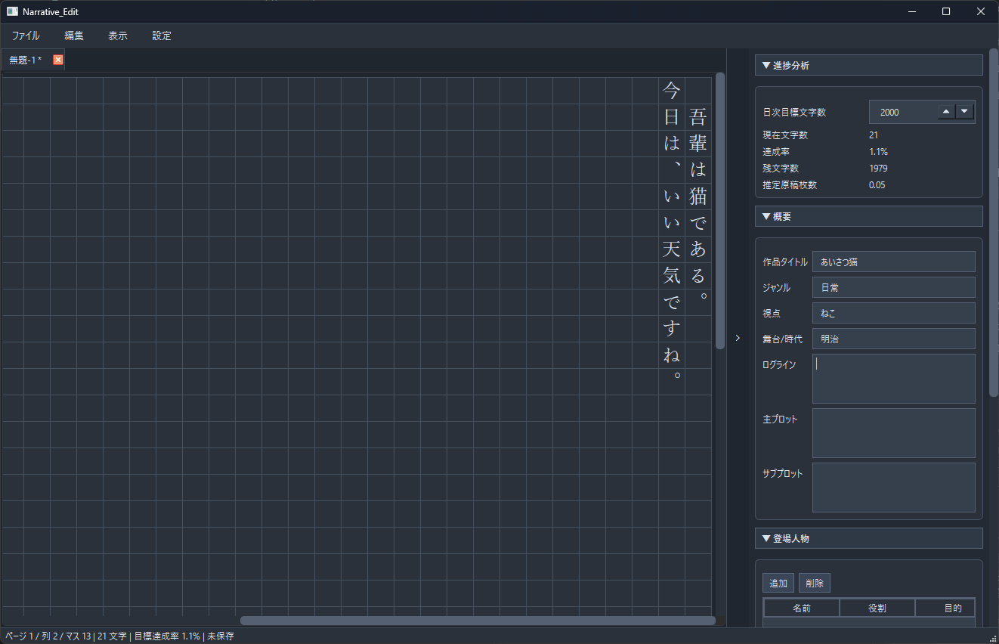
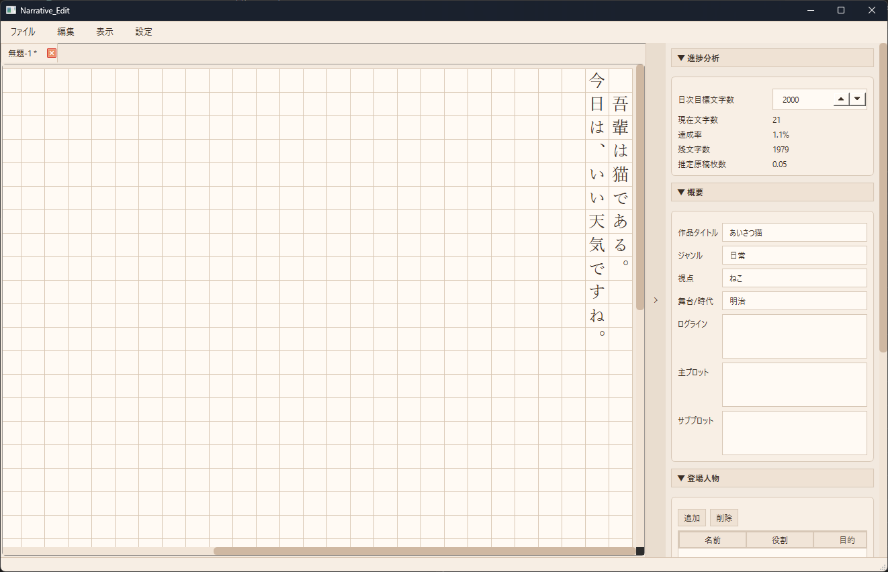
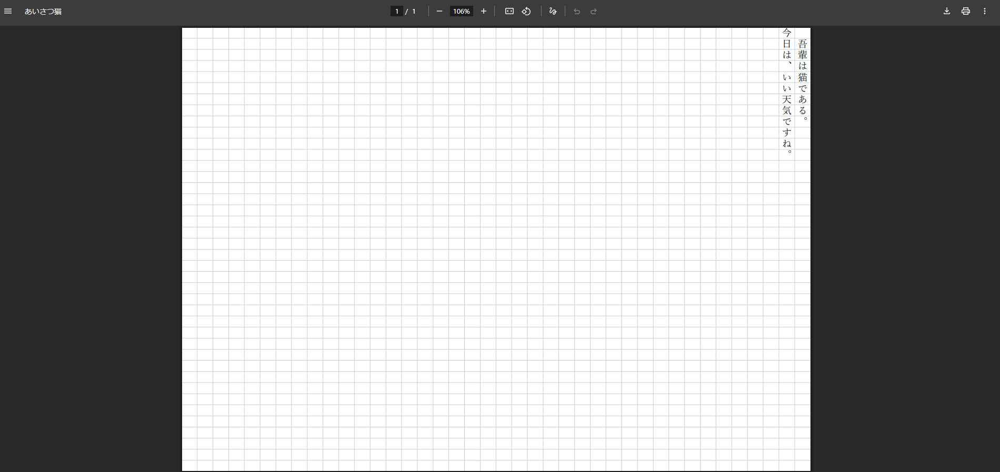

# Narrative_Edit

縦書き小説向けの執筆エディタです。  
本文編集とプロット管理を1画面で行えます。

## 主な機能
- 縦書き本文エディタ（原稿用紙グリッド）
- タブ編集（新規/保存/別名保存/最近のファイル）
- VSCode風の左サイドバー（エクスプローラ/検索）
- 作業フォルダを `開く` またはドラッグ&ドロップで設定
- 作業フォルダ内を階層ツリー表示（ディレクトリ表示あり）
- ツリー上のテキストファイルをクリックしてタブで開く
- 作業フォルダ内に新規テキストファイル作成
- PDF書き出し
  - 現在タブを書き出し
  - 作業フォルダ内の複数テキスト本文を先頭から末尾へ連結して1つのPDFに書き出し
- 右側プロットパネル（登場人物/章構成/設定/進捗）
- タブ右上ボタンから新しいウィンドウを起動

## スクリーンショット
- エディタ全体  


- 左サイドバーとプロットパネル  


- PDF出力  


## セットアップ
```powershell
python -m venv .venv
.\.venv\Scripts\Activate.ps1
python -m pip install -r requirements.txt
```

## 開発起動
```powershell
python src\main.py
```

## EXEビルド（Windows）
```powershell
.\.venv\Scripts\Activate.ps1
python -m pip install pyinstaller
python -m PyInstaller --noconfirm --onefile --windowed --name Narrative_Edit --distpath dist --workpath build src\main.py
```

## ドキュメント
- 仕様: `docs/specification.md`
- 開発メモ: `開発の流れ.txt`
